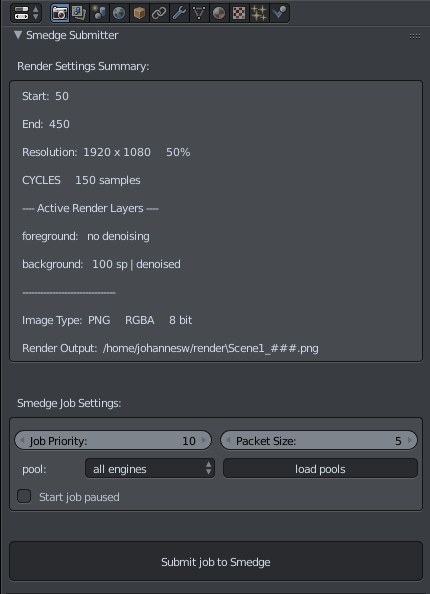

# Smedge Submitter Addon for Blender

This script enables you to submit jobs to the Smedge render manager without leaving Blender. Just hit submit and you are done. It is tested to work under Windows, Mac and Linux.

The features are:
- Display a summary of the most important rendersettings. This should help to decrease the amount of wrong job submissions
- loading pools from the render farm
- submit the job to the render farm including priority and packet size

## Installation
The script only works in combination with Smedge. So make sure Smedge is installed on your System.

There are two ways to install this script:
- Install it like every other addon in blender. Within Blender go to "File -> User Preferences -> Add-ons -> Install Add-on from File" select the "SmedgeSubmit.py" and hit install. Then activate it and save your user settings. The script is now located in your Blender settings folder under "scripts/addons/"
- Copy the "SmedgeSubmit.py" to "scripts/startup"" folder. That's it. Nothing more to do. It will be automatically loaded when Blender starts up

The last thing you have to do is editing the "SmedgeSubmit.py" in a text editor and adjust the path at the top of the file pointing to your Smedge installation directory. 
Actually there are three paths, one for Windows, one for Linux and one for MacOS. You only have to adjust the one that's for your operating system if you don't use multiple platforms in your farm. If you intend to use multiple operating systems and you are syncing the script to all of the machines it makes sense to adjust all the paths.
Btw: The default Windows and Mac paths should already work in most cases. So you probably don't have to adjust anyting if you are using these operating systems...

## Known Issues

- Updating pools seems to not work under Linux. That's why those settings are not exposed on a linux system. If you need to send your job to a specific pool there's a workaround: Send it your job paused and then edit the job within the SmedgeGui to assign the correct pool.

